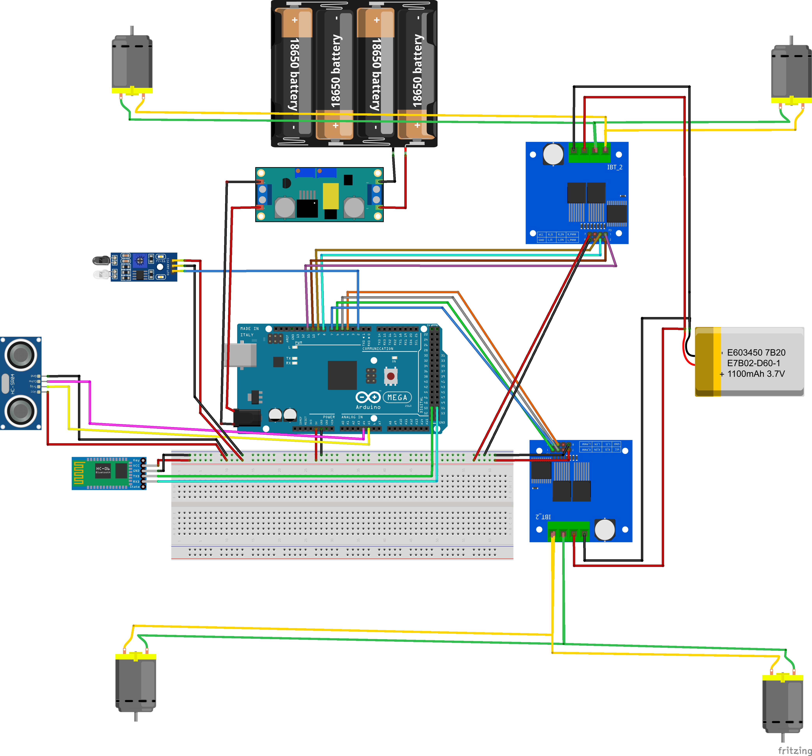
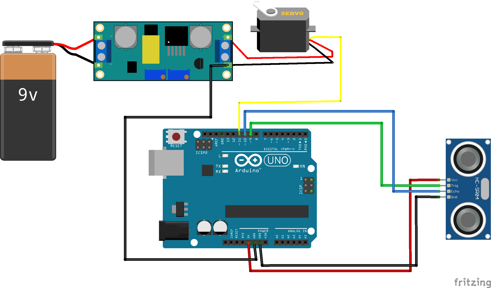
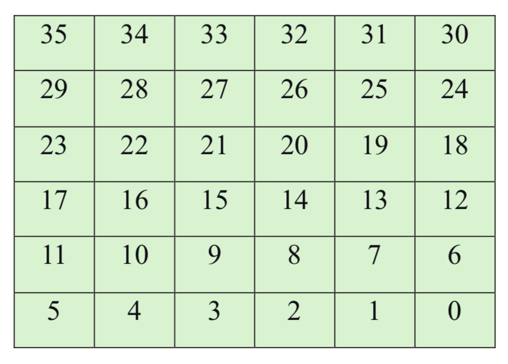
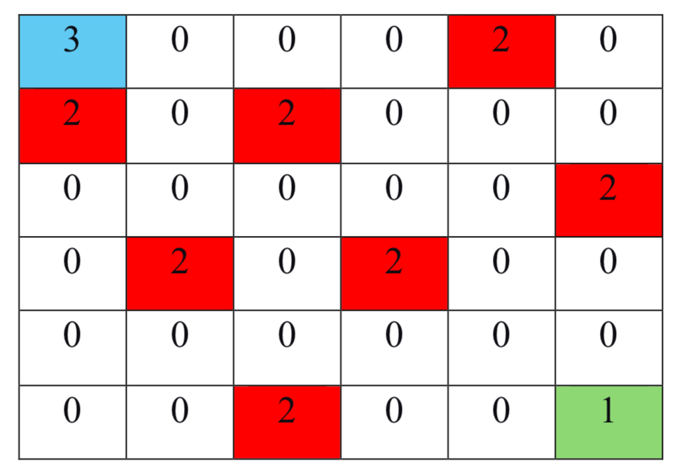
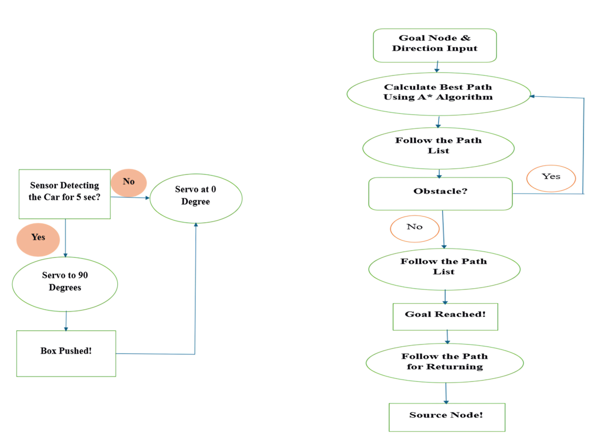

# Goal-Oriented Autonomous Robotic Car with Obstacles Avoidance and Box Retrieval System

**Domains:** Robotics, Path Planning, Autonomous Systems, Microcontroller Programming  

  

<video src="assets/demonstration.mp4" controls="controls" width="100%"></video>

## Project Overview
This project explores the implementation of real-time path planning algorithms in a known environment using an autonomous robotic car. The system is equipped with an ultrasonic sensor for obstacle avoidance and a push-box mechanism for object retrieval. Designed within a controlled, two-dimensional 6x6 grid-based environment, this project demonstrates how academic algorithms like the A* search can be effectively deployed on microcontroller hardware with limited computation and storage capabilities.

*Figure: Conceptual sketch of the autonomous robotic car.*

## Key Features & Capabilities
* **Autonomous Navigation:** Utilizes the A* search algorithm to calculate the optimal path (minimizing f-cost) from a starting node to a goal node.
* **Real-Time Obstacle Avoidance:** Employs an ultrasonic sensor to detect obstacles dynamically; if a new obstacle is detected, the car recalculates its path on the fly using the A* algorithm.
* **Grid-Based Movement:** Navigates a 6x6 grid where each node has a unique ID (0-35). The car restricts movements to 90-degree turns and basic directional steps (forward, backward, left, right) to optimize computational efficiency.
* **Position Feedback:** Uses an IR sensor to sense the black color of the grid nodes and update the car's current position in real-time.
* **Box Retrieval System:** Features a push-box mechanism that triggers a servo motor to push an object safely into the car's enclosed safety rail after a secondary ultrasonic sensor confirms the car's presence at the goal.

*Figure: Sketch of the push-box retrieval mechanism.*

## Hardware & Components
* Arduino Mega (2x)
* Robot car chassis & DC Gear Motors (4x)
* Ultrasonic sensors & IR sensors
* Servo Motor (2x) & Linear Actuator (1x)
* Motor Driver (3x)
* Bluetooth Module

## Methodology & Algorithm Flow

### Grid Environment Map
The car navigates a predefined 6x6 grid where obstacles (marked as '2'), the starting optimal node ('1'), and the goal ('3') are mathematically mapped. 

*Figure: The 6x6 grid framework for navigation.*

*Figure: Predefined representation of obstacles within the grid.*

### Algorithm Flow
1. **Input:** Receives goal node and direction input via Bluetooth.
2. **Path Calculation:** Arduino executes the A* algorithm to find the optimum path and outputs it via serial print.
3. **Execution & Feedback:** The car follows the path list, updating its position using IR sensor feedback.
4. **Obstacle Handling:** If an obstacle is detected, the path is recalculated immediately.
5. **Retrieval:** Upon reaching the goal, the push mechanism is activated to retrieve the object.
6. **Return:** The car retraces its path to the source node.

*Figure: Algorithm flow of the proposed model.*

## Results & Future Work
The project successfully demonstrated a working real-time path-planning system that can navigate a grid, dynamically avoid collisions, and execute mechanical tasks. 

**Future Improvements:**
* **Dynamic Mapping:** Transitioning from a pre-installed map to an exploratory model where the car maps the area for obstacles and uploads it to memory autonomously.
* **Time Optimization:** Programming the system to prioritize the shortest time approach rather than just the shortest path, saving valuable operational time in industrial settings.
* **Advanced Algorithms:** Incorporating machine learning or adaptive algorithms to handle dynamic environments and complex spaces with greater efficiency.
